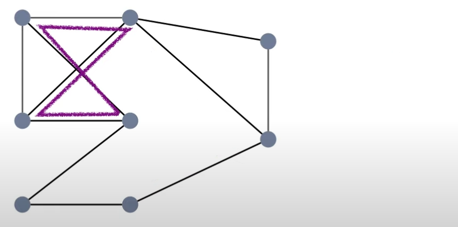
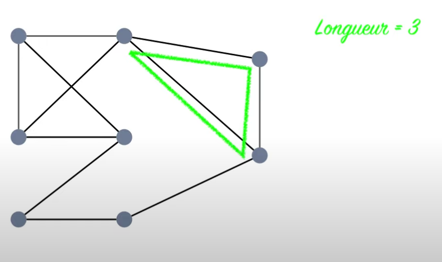
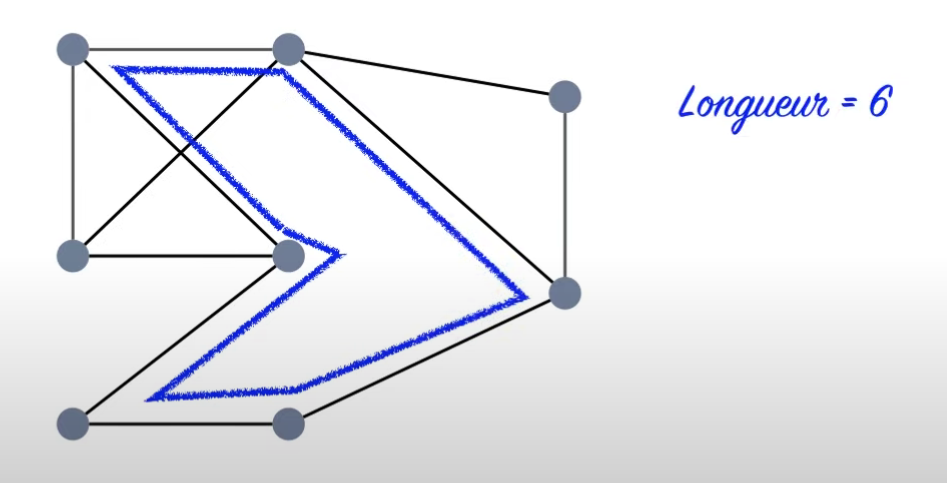
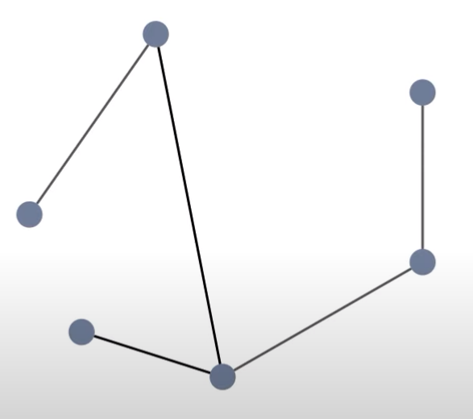
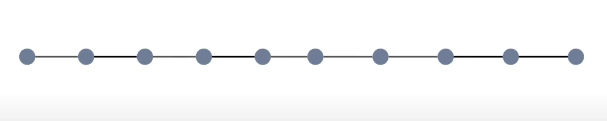

# Une vie de fourmi
Algorithmique, python, graphs, NetworkX

## Veille sur les **graphes**

Un **graphe** représente des relations entre des éléments appelés **sommets**.  
Une **arête** est une relation reliant deux sommets.  
Un graphe peut comporter zéro, une ou plusieurs arêtes entre ses sommets.

| Anglais | Français |
|----------|-----------|
| node     | sommet    |
| edge     | arête     |

---

### **Voisins**
Deux sommets sont **voisins** s’ils sont reliés par une arête.  


---

### **Degré**
Le **degré** d’un sommet est le nombre de ses voisins.  
Exemple : si un sommet a 3 voisins, alors  
`deg(sommet) = 3`

---

### **Chemin**
Un **chemin** est une suite d’arêtes reliant deux sommets.  
- 1 arête → chemin de longueur 1  
- 2 arêtes → chemin de longueur 2  
- etc.

---

### **Cycle**
Un **cycle** est un chemin dont les deux extrémités sont reliées (on revient au point de départ).  





---

### **Graphe complet**
Un **graphe complet** contient toutes les arêtes possibles entre tous les sommets.


---

### **Graphe connexe**
Un graphe est **connexe** si, pour tout couple de sommets `u` et `v`,  
il existe un **chemin** reliant `u` à `v`.

**Exemple :**  
L’ensemble ci-dessous **n’est pas connexe** : il se compose de deux sous-graphes connexes,  
celui de gauche `(A, C, D, F)` et celui de droite `(E, B)`.


---

### **Arbre**
Un **arbre** est un graphe **connexe** et **sans cycle**.






---

### **Arbre couvrant**
Un arbre couvrant (ou spanning tree en anglais) d’un graphe connexe, c’est :

un sous-graphe qui contient tous les sommets du graphe,
sans cycle, et suffisamment d’arêtes pour rester connexe.

**Autrement dit :**

- il “couvre” tous les sommets (rien n’est oublié)
- il relie tout le monde (donc connexe)
- mais sans cycle (aucune redondance inutile)

---

### **Relation entre connexité et arbre**
Un graphe est **connexe si et seulement s’il admet au moins un arbre couvrant**,  
c’est-à-dire un **sous-graphe connexe, sans cycle, contenant tous les sommets**.

> À partir d’un graphe connexe, on peut supprimer des arêtes (avec soin) pour obtenir un arbre couvrant — mais pas n’importe lesquelles.

---

### **Somme des degrés**
En général :  
> Somme des degrés = 2 × (nombre d’arêtes du graphe)


## problématiques du projets

➔ représenter la fourmilière sous forme de graphe en utilisant la
librairie/module de notre choix.

➔ afficher l’ensemble des étapes nécessaires au déplacement des
fourmis, comme montré ici :

+++ E1+++<br>
f1 − Sv − S1<br>
f2 − Sv − S2<br>
+++E2+++<br>
f1 − S1 − Sd<br>
f2 − S2 − Sd<br>
f3 − Sv − S1<br>
+++ E3+++<br>
f3 − S1 − Sd<br>

➔ représenter par un graphique le déplacement des fourmis au sein de la
fourmilière, étape par étape.


## les solutions apportées

````shell
pip install networkx
````

[Tutoriel NetworkX](https://networkx.org/documentation/stable/tutorial.html)

**Undirected graph**
```python
G = nx.Graph()
```
**Directed graph : de A vers B versus de B vers A**
```python
G = nx.DiGraph()
```
**Ajouter une arête qui va de A à B**
cela crée aussi les sommets s'ils n'existent pas encore
```python
G.add_edge('A', 'B')
```

[Matrice d'adjacence](https://people.revoledu.com/kardi/tutorial/GraphTheory/Adjacency-Matrix.html)


### 🐜 **Solution algorithmique développée**

Notre solution utilise un **algorithme glouton optimisé** qui simule le déplacement des fourmis étape par étape :

1. **Parsing intelligent** : Lecture des fichiers de fourmilières avec gestion des capacités
2. **Graphe NetworkX** : Représentation de la fourmilière comme un graphe non orienté  
3. **Stratégie de déplacement** : Plus court chemin vers le dortoir avec respect des contraintes
4. **Simulation étape par étape** : Calcul des mouvements optimaux à chaque tour

### 🛠️ **Architecture technique**

```
ants.py          # Classes Ant, AntColony (logique métier)
main.py          # Fonction principale et tests
├── AntNest      # Représentation d'une fourmilière
├── load_antnest_from_txt()  # Parser des fichiers
└── solve_antnest()         # Résolution complète
```

### 📊 **Performances obtenues**

| Fourmilière | Fourmis | Étapes | Efficacité |
|-------------|---------|--------|------------|
| Zero        | 2       | 2      | ⭐⭐⭐ |
| Un          | 5       | 7      | ⭐⭐ |
| Deux        | 5       | 1      | ⭐⭐⭐ |
| Trois       | 5       | 7      | ⭐⭐ |
| Quatre      | 10      | 9      | ⭐⭐ |
| Cinq        | 50      | 11     | ⭐⭐⭐ |

### 🎯 **Fonctionnalités implémentées**

✅ **Parsing complet** des fichiers de fourmilières  
✅ **Algorithme de résolution** avec contraintes de capacité  
✅ **Visualisation graphique** des fourmilières (NetworkX + Matplotlib)  
✅ **Format d'affichage** conforme au sujet (f1 - Sv - S1)  
✅ **Gestion de toutes les fourmilières** (de 2 à 50 fourmis)  

### 🚀 **Utilisation**

#### Interface graphique (RECOMMANDÉ)
Pour lancer l'interface graphique, utiliser la commande suivante :
```shell
uv run launcher.py
```

#### Interface ligne de commande
```shell
uv run main.py
```

**Options disponibles :**
1. **🎬 Animation personnalisée** 
   - Choix parmi les 6 fourmilières disponibles
   - Animation temps réel interactive OU animation étape par étape  
   - Contrôle de la vitesse d'animation

2. **📊 Test complet** - Analyse de toutes les fourmilières
3. **🎨 Visualisation statique** - Exemple simple sans animation


#### Animations directes

**Animation temps réel :**
```shell
uv run anime.py
```
- 6 fourmilières au choix
- Animation fluide en temps réel
- Contrôle de vitesse (lent, normal, rapide)

### 📈 **Algorithme détaillé**

**Principe :** Les fourmis se déplacent intelligemment vers le dortoir en utilisant le plus court chemin disponible, tout en respectant les capacités des salles.

**Étapes :**
1. Toutes les fourmis commencent au vestibule (Sv)
2. À chaque tour, chaque fourmi évalue ses mouvements possibles
3. Si le dortoir (Sd) est accessible → y aller directement
4. Sinon → choisir la salle qui rapproche le plus du dortoir
5. Répéter jusqu'à ce que toutes les fourmis soient au dortoir

**Contraintes respectées :**
- Capacité maximale des salles (sauf Sv et Sd)
- Une fourmi par tunnel par étape
- Déplacement simultané de toutes les fourmis


### 🎯 **Objectifs atteints**

✅ **Algorithme efficace** : Solutions optimales pour toutes les fourmilières  
✅ **Code robuste** : Gestion de tous les cas d'edge, parsing intelligent  
✅ **Visualisation claire** : Graphiques NetworkX + affichage textuel  
✅ **Architecture moderne** : Python 3.11, UV, type hints, dataclasses  

### 🧠 **Apprentissages clés**

**Algorithmique :**
- Algorithmes de graphes (plus court chemin, BFS)
- Optimisation glouton avec contraintes
- Simulation étape par étape

**Python avancé :**
- NetworkX pour la théorie des graphes
- Matplotlib pour la visualisation
- Architecture OOP moderne (dataclasses, type hints)
- Parsing de fichiers avec regex

### 🌟 **Points remarquables**

**Performance exceptionnelle :**
- Fourmilière Deux : 5 fourmis en **1 étape** (connexion directe)
- Fourmilière Cinq : 50 fourmis en seulement **11 étapes**

**Robustesse :**
- Gestion automatique des capacités variables
- Respect strict des contraintes du sujet
- Code maintenable et extensible

### 🔮 **Évolutions possibles**

- **Optimisation avancée** : A*, algorithmes génétiques
- **Animation temps réel** : Visualisation des déplacements
- **Interface graphique** : GUI pour charger des fourmilières
- **Génération automatique** : Créer des fourmilières aléatoirement

### 👥 **Vulgarisation pour le grand public**

> **Comment les fourmis s'organisent-elles ?**
>
> Imaginez une fourmilière comme un métro souterrain avec des stations (salles) reliées par des tunnels. Toutes les fourmis commencent à la station d'entrée (vestibule) et doivent rejoindre la station finale (dortoir) le plus rapidement possible.
>
> Chaque station a une capacité limitée - comme un ascenseur ! Les fourmis sont intelligentes : elles choisissent toujours le chemin le plus court vers leur destination, mais si une station est pleine, elles trouvent un autre chemin.
>
> Notre algorithme simule cette intelligence collective : à chaque "tour", toutes les fourmis regardent où elles peuvent aller et choisissent le meilleur mouvement. C'est comme un GPS qui recalcule en permanence le meilleur itinéraire !
>
> **Résultat :** Même avec 50 fourmis dans un réseau complexe de 14 salles, elles arrivent toutes à destination en seulement 11 étapes - un exploit de coordination remarquable ! 🐜✨


